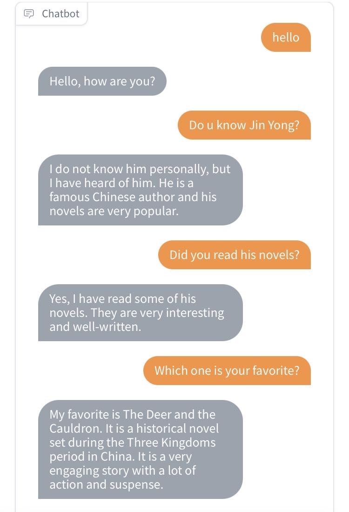
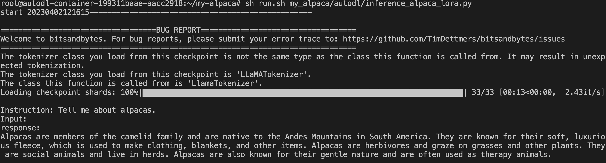

# my-alpaca
Try original alpaca. The multi-turn version is at [multi-turn-alpaca](https://github.com/l294265421/multi-turn-alpaca) and the version further trained with RLHF (Reinforcement Learning with Human Feedback) is at [alpaca-rlhf](https://github.com/l294265421/alpaca-rlhf). The trained multi-turn alpaca is amazing. There is a chat case with the multi-turn alpaca:

## Step by Step
### Colab (Free colab is too slow to perform one epoch)
- [finetune](my_alpaca/colab/finetune.ipynb)

### [Autodl](https://www.autodl.com/home)
- [filetune](my_alpaca/autodl/finetune.py)
  - nohup sh run.sh my_alpaca/autodl/finetune.py > autodl.log 2>&1 &
- [inference_llama](my_alpaca/autodl/inference_llama.py)
  - sh run.sh my_alpaca/autodl/inference_llama.py
  
- [inference_llama_gradio](my_alpaca/autodl/inference_llama_gradio.py)
  - sh run.sh my_alpaca/autodl/inference_llama_gradio.py
- [inference_alpaca_lora](my_alpaca/autodl/inference_alpaca_lora.py)
  - sh run.sh my_alpaca/autodl/inference_alpaca_lora.py
  
- [inference_alpaca_lora_gradio](my_alpaca/autodl/inference_alpaca_lora_gradio.py)
    - sh run.sh my_alpaca/autodl/inference_alpaca_lora_gradio.py

## Pre-train
### Models
- T5
  - [Paper](./papers/pre-train/models/2020-JMLR-Exploring%20the%20Limits%20of%20Transfer%20Learning%20with%20a%20Unified%20Text-to-Text%20Transformer.pdf)
- GPT
  - Paper
    - [GPT](https://s3-us-west-2.amazonaws.com/openai-assets/research-covers/language-unsupervised/language_understanding_paper.pdf)
    - [GPT-2](https://cdn.openai.com/better-language-models/language_models_are_unsupervised_multitask_learners.pdf)
    - [GPT-3](https://arxiv.org/pdf/2005.14165.pdf)
- LaMDA
  - [Paper](https://arxiv.org/pdf/2201.08239.pdf)
- JURASSIC-1
  - [Paper](https://uploads-ssl.webflow.com/60fd4503684b466578c0d307/61138924626a6981ee09caf6_jurassic_tech_paper.pdf)
- MT-NLG
  - [Paper](https://arxiv.org/pdf/2201.11990.pdf)
- ERNIE
  - Paper
    - [ERNIE](https://arxiv.org/pdf/1904.09223.pdf)
    - [ERNIE 2.0](https://arxiv.org/pdf/1907.12412.pdf)
    - [ERNIE 3.0](https://arxiv.org/pdf/2107.02137.pdf)
- Gopher
  - [Paper](https://storage.googleapis.com/deepmind-media/research/language-research/Training%20Gopher.pdf)
- Chinchilla
  - [Paper](https://arxiv.org/pdf/2203.15556.pdf)
- PaLM
  - [Paper](https://arxiv.org/pdf/2204.02311.pdf)
- OPT
  - [Paper](https://arxiv.org/pdf/2205.01068.pdf)
- BLOOM
  - [Paper](https://arxiv.org/pdf/2211.05100.pdf)
- LLaMA
  - [Paper](./papers/pre-train/models/2023-LLaMA-%20Open%20and%20Efficient%20Foundation%20Language%20Models.pdf)
  - [Model](https://huggingface.co/decapoda-research)
- GLM
  - [Paper](./papers/pre-train/models/2023-ICLR-GLM-130B-%20An%20Open%20Bilingual%20Pre-trained%20Model.pdf)
  - [GitHub](https://github.com/THUDM/GLM)
- BloombergGPT
  - [Paper](https://arxiv.org/abs/2303.17564)

### Methods
#### Max Sequence Length

#### Position

## Fine-tune
### Models
#### General
- Alpaca: A Strong, Replicable Instruction-Following Model
  - [Site](https://crfm.stanford.edu/2023/03/13/alpaca.html)
  - [GitHub](https://github.com/tatsu-lab/stanford_alpaca#fine-tuning)
- Vicuna: An Open-Source Chatbot Impressing GPT-4 with 90%* ChatGPT Quality
  - [GitHub](https://github.com/lm-sys/FastChat)
  - [Site](https://vicuna.lmsys.org/)
  - [Online Demo](https://chat.lmsys.org/)
- Koala: A Dialogue Model for Academic Research
  - [Blog](https://bair.berkeley.edu/blog/2023/04/03/koala/)
  - GitHub
      - [Koala_data_pipeline](https://github.com/young-geng/koala_data_pipeline)
      - [Koala Evaluation Set](https://github.com/arnav-gudibande/koala-test-set)
- alpaca-lora
  - [GitHub](https://github.com/tloen/alpaca-lora)
- ChatGLM-6B
  - [GitHub](https://github.com/THUDM/ChatGLM-6B)
  - [Blog](https://chatglm.cn/blog)
- Firefly
  - [GitHub](https://github.com/yangjianxin1/Firefly)
- thai-buffala-lora-7b-v0-1
  - [Model](https://huggingface.co/Thaweewat/thai-buffala-lora-7b-v0-1)
- multi-turn-alpaca
  - [GitHub](https://github.com/l294265421/multi-turn-alpaca)
- Open-Assistant
  - [Site](https://open-assistant.io/zh)
  - [GitHub](https://github.com/LAION-AI/Open-Assistant)
  - [Paper](./papers/2023-OpenAssistant%20Conversations%20-%20Democratizing%20Large%20Language%20Model%20Alignment.pdf)

#### Chinese
- Chinese-ChatLLaMA
  - [GitHub](https://github.com/ydli-ai/Chinese-ChatLLaMA)
  - Blog
    - [训练中文LLaMA大规模语言模型](https://zhuanlan.zhihu.com/p/612752963)
    - [ChatLLaMA：用指令微调训练中文对话大模型](https://zhuanlan.zhihu.com/p/616748134)
- BELLE
  - [GitHub](https://github.com/LianjiaTech/BELLE)
- Chinese-LLaMA-Alpaca
  - [GitHub](https://github.com/ymcui/Chinese-LLaMA-Alpaca)
- Luotuo-Chinese-LLM
  - [GitHub](https://github.com/LC1332/Luotuo-Chinese-LLM)
- Chinese-Vicuna
  - [GitHub](https://github.com/Facico/Chinese-Vicuna)
- Chinese-alpaca-lora
  - [GitHub](https://github.com/LC1332/Chinese-alpaca-lora)

#### Japanese
- Japanese-Alpaca-LoRA
  - [GitHub](https://github.com/kunishou/Japanese-Alpaca-LoRA)

#### Medical
- 2023-ChatDoctor: A medical chat model fine-tuned on llama model using medical domain knowledge
  - [Paper](./papers/2023-ChatDoctor-%20A%20Medical%20Chat%20Model%20Fine-tuned%20on%20LLaMA%20Model%20using%20Medical%20Domain%20Knowledge.pdf)
- 华驼(HuaTuo): 基于中文医学知识的LLaMA微调模型
  - [GitHub](https://github.com/SCIR-HI/Huatuo-Llama-Med-Chinese)

#### Law
- LawGPT_zh：中文法律大模型（獬豸）
  - [GitHub](https://github.com/LiuHC0428/LAW-GPT)

#### Recommendation
- 2023-Recalpaca: Low-rank llama instruct-tuning for recommendation

### Methods
- 2021-LoRA- Low-Rank Adaptation of Large Language Models [[paper](./papers/2021-LoRA-%20Low-Rank%20Adaptation%20of%20Large%20Language%20Models.pdf)]
- 2023-RRHF: Rank Responses to Align Language Models with Human Feedback without tears [[paper](./papers/2023-RRHF-%20Rank%20Responses%20to%20Align%20Language%20Models%20with%20Human%20Feedback%20without%20tears.pdf)] [[code](https://github.com/GanjinZero/RRHF)]

## Integrating External Data
### Methods
- langchain
  - GitHub
    - [langchain](https://github.com/hwchase17/langchain)
    - [Chinese-LangChain](https://github.com/yanqiangmiffy/Chinese-LangChain)

## Dataset
### For Pre-training
- RedPajama-Data
  - [GitHub](https://github.com/togethercomputer/RedPajama-Data)
  - [RedPajama-Data-1T-HuggingFace](https://huggingface.co/datasets/togethercomputer/RedPajama-Data-1T)
- 大规模中文自然语言处理语料 Large Scale Chinese Corpus for NLP
  - [GitHub](https://github.com/brightmart/nlp_chinese_corpus)
- CSL: A Large-scale Chinese Scientific Literature Dataset 中文科学文献数据集
  - [GitHub](https://github.com/ydli-ai/CSL)
- 中文图书语料集合
  - [GitHub](https://github.com/FudanNLPLAB/CBook-150K)
- Chinese Open Instruction Generalist (COIG)
  - [Paper](https://arxiv.org/pdf/2304.07987v1.pdf)
- 医疗数据集
  - [GitHub1](https://github.com/NLPxiaoxu/LLM-FineTune)
- 金融数据
  - [FinNLP-GitHub](https://github.com/AI4Finance-Foundation/FinNLP)
  - [SmoothNLP 金融文本数据集(公开) | Public Financial Datasets for NLP Researches](https://github.com/smoothnlp/FinancialDatasets)  

### For SFT
- ChatAlpaca
  - [GitHub](https://github.com/cascip/ChatAlpaca)
- InstructionZoo
  - [GitHub](https://github.com/FreedomIntelligence/InstructionZoo)

### For Reward Model

### Methods
- 2022-SELF-INSTRUCT- Aligning Language Model with Self Generated Instructions [[paper](./papers/2022-SELF-INSTRUCT-%20Aligning%20Language%20Model%20with%20Self%20Generated%20Instructions.pdf)]

## Evaluation
- LLMZoo: a project that provides data, models, and evaluation benchmark for large language models.
  - [GitHub](https://github.com/FreedomIntelligence/LLMZoo)

## Products
- [ChatGPT](https://chat.openai.com/)
- [文心一言](https://yiyan.baidu.com/)
- [通义千问](https://tongyi.aliyun.com/)
- AgentGPT
  - [GitHub](https://github.com/reworkd/AgentGPT)
- HuggingGPT
  - [GitHub](https://github.com/microsoft/JARVIS)
  - [Paper](https://arxiv.org/abs/2303.17580)
- AutoGPT
  - [GitHub](https://github.com/Significant-Gravitas/Auto-GPT)
- MiniGPT-4
  - [GitHub](https://github.com/Vision-CAIR/MiniGPT-4)
  - [Paper](./papers/2023-MiniGPT_4.pdf)
- ShareGPT
  - [GitHub](https://github.com/domeccleston/sharegpt)

## Tools
- [DeepSpeed](https://github.com/microsoft/DeepSpeed)
  - [DeepSpeed-Chat](https://github.com/microsoft/DeepSpeedExamples/tree/master/applications/DeepSpeed-Chat)
- [ColossalAI](https://github.com/hpcaitech/ColossalAI)
- [Megatron-LM](https://github.com/NVIDIA/Megatron-LM)

## Related Topics
### Neural Text Generation
- 2020-ICLR-Neural text generation with unlikelihood training [[paper](./papers/2020-ICLR-Neural%20text%20generation%20with%20unlikelihood%20training.pdf)]
- 2021-ICLR-Mirostat- a neural text decoding algorithm that directly controls perplexity [[paper](./papers/2021-ICLR-Mirostat-%20a%20neural%20text%20decoding%20algorithm%20that%20directly%20controls%20perplexity.pdf)]
- 2022-NIPS-A Contrastive Framework for Neural Text Generation [[paper](./papers/2022-NIPS-A%20Contrastive%20Framework%20for%20Neural%20Text%20Generation.pdf)]

### Distributed Training
- [Pytorch 分布式训练](https://zhuanlan.zhihu.com/p/76638962)
  - [浅谈Tensorflow分布式架构：ring all-reduce算法](https://zhuanlan.zhihu.com/p/69797852)
  - [Optimizer state sharding (ZeRO)](https://zhuanlan.zhihu.com/p/394064174)
    - [ZeRO-Offload](https://www.deepspeed.ai/tutorials/zero-offload/)
  - 图解大模型训练
    - [图解大模型训练之：流水线并行（Pipeline Parallelism），以Gpipe为例](https://zhuanlan.zhihu.com/p/613196255)
    - [图解大模型训练之：数据并行上篇(DP, DDP与ZeRO)](https://zhuanlan.zhihu.com/p/617133971)
    - [图解大模型训练之：数据并行下篇( DeepSpeed ZeRO，零冗余优化)](https://zhuanlan.zhihu.com/p/618865052)

### Quantization
- 2020-Integer Quantization for Deep Learning Inference Principles and Empirical Evaluation [[paper](./papers/2020-Integer%20Quantization%20for%20Deep%20Learning%20Inference%20Principles%20and%20Empirical%20Evaluation.pdf)]

## Other
- [如何为GPT/LLM模型添加额外知识？](https://www.zhihu.com/question/591935281/answer/2979220793)